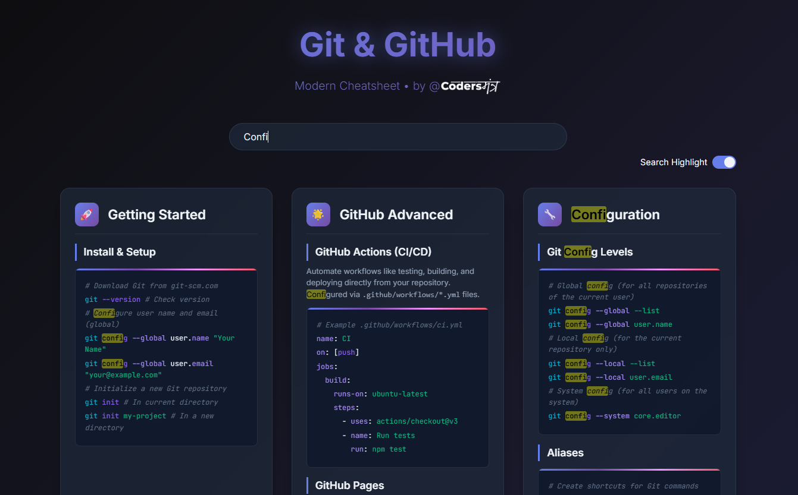

# web-dev-cheatsheets

# Web Developer Cheatsheet Library

A curated collection of modern, visually appealing cheatsheets for web development technologies, designed to help developers quickly reference key concepts, syntax, and best practices. This library includes cheatsheets for HTML, CSS, JavaScript, and more, with a focus on clean design and practical examples.

## Table of Contents
- [Available Cheatsheets](#available-cheatsheets)
- [Features](#features)
- [Installation](#installation)
- [Usage](#usage)
- [Contributing](#contributing)
- [License](#license)

## Available Cheatsheets
- **JavaScript Cheatsheet**: 👉 [Visit](https://pawan-maurya.github.io/web-dev-cheatsheets/javascript-cheatsheet/index.html) | Covers variables, functions, arrays, objects, loops, conditionals, and ES6+ features.
- **React.js v19 Cheatsheet**: 👉 [Visit](https://pawan-maurya.github.io/web-dev-cheatsheets/reactjs-v19-cheatsheet/) | Modern Cheatsheet • React js tailored for v19
- **Tailwind CSS Cheatsheet**: 👉 [Visit](https://pawan-maurya.github.io/web-dev-cheatsheets/tailwind-css-cheatsheet/) | v4 and v4. New Features added
- **HTML5 Cheatsheet**: 👉 [Visit](https://pawan-maurya.github.io/web-dev-cheatsheets/html5-cheatsheet/) | Comprehensive HTML5 Cheatsheet • Covers Essential HTML5 Elements and Concepts.
- **Git & GitHub Cheatsheet**: 👉 [Visit](https://pawan-maurya.github.io/web-dev-cheatsheets/git-github-cheatsheet/) | Comprehensive Git and GitHub Cheatsheet • Covers Essential Git Commands, Workflows, and GitHub Features.
- *More cheatsheets coming soon (e.g., CSS, React, Next.js, etc.)!*

*For example:* To view the JavaScript cheatsheet, open `javascript-cheatsheet/index.html` in your browser or visit the hosted version at [JavaScript Cheatsheet](https://pawan-maurya.github.io/web-dev-cheatsheets/javascript-cheatsheet/index.html).

**Preview:**



## Features
- **Modern Design**: Dark-themed, trendy UI with responsive layouts for easy reading.
- **Comprehensive Content**: Covers essential web development topics with concise code snippets.
- **Search Functionality**: Quickly find topics or keywords within each cheatsheet.
- **Search Text Highlight**: Instantly highlights matching search terms for easier navigation.
- **Open Source**: Hosted on GitHub, open for contributions and improvements.
- **Developer-Friendly**: Structured for quick reference during coding sessions.

## Installation
To use the cheatsheets locally or contribute to the project, follow these steps:

1. **Clone the Repository**:
   ```bash
   git clone https://github.com/pawan-maurya/web-dev-cheatsheets.git
   ```
2. **Navigate to the Project Directory**:
   ```bash
   cd web-dev-cheatsheets
   ```
3. **Open Cheatsheets**:
   - Open any cheatsheet (e.g., `javascript-cheatsheet/index.html`) in a web browser to view locally.
   - No additional dependencies are required as the cheatsheets are built with vanilla HTML and CSS.

## Usage
- **Browse Cheatsheets**: Access the cheatsheets directly via the GitHub Pages site (if hosted) or locally by opening the HTML files in a browser.
- **Searchable Content**: Each cheatsheet is organized into sections (e.g., Variables, Functions, Arrays) for quick navigation.
- **Responsive Design**: Viewable on desktop, tablet, or mobile devices.
- **Contribute**: Add new cheatsheets or improve existing ones by following the [Contributing](#contributing) guidelines.

## Contributing
We welcome contributions to expand and improve this library! To contribute:

1. **Fork the Repository**: Click the "Fork" button on GitHub to create your own copy.
2. **Create a New Branch**:
   ```bash
   git checkout -b feature/new-cheatsheet
   ```
3. **Add or Update Cheatsheets**:
   - Follow the existing structure (HTML/CSS with a dark theme).
   - Ensure code snippets are accurate and concise.
   - Use the same color scheme and typography for consistency (see `javascript-cheatsheet/index.html` for reference).
4. **Commit Changes**:
   ```bash
   git commit -m "Add new cheatsheet for [Technology]"
   ```
5. **Push to Your Fork**:
   ```bash
   git push origin feature/new-cheatsheet
   ```
6. **Submit a Pull Request**: Open a PR on GitHub with a clear description of your changes.

Please adhere to the following guidelines:
- Maintain the dark-themed, modern UI design.
- Test your cheatsheet in multiple browsers for compatibility.
- Include clear, commented code snippets.
- Update this README if adding new cheatsheets.


## License
This project is licensed under the MIT License. See the [LICENSE](LICENSE) file for details.

---
*Built with ❤️ for web developers. Contributions and feedback are welcome!*
